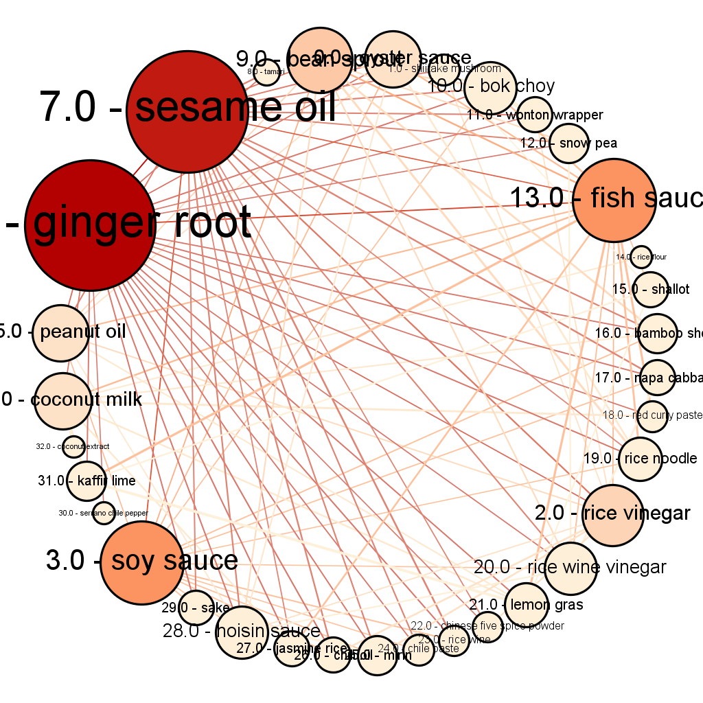

This is an R Markdown document. Markdown is a simple formatting syntax for authoring HTML, PDF, and MS Word documents. For more details on using R Markdown see <http://rmarkdown.rstudio.com>.

When you click the **Knit** button a document will be generated that includes both content as well as the output of any embedded R code chunks within the document. You can embed an R code chunk like this:
```{r setup, include=FALSE}
library(network)
library(lattice)
library(latticeExtra)
library(ergm)
library(intergraph)
library(sand)
setwd("C:/Users/TG/Documents/495/hwk5/hwk5")
source("hwk5-utils.R")
loadflo()
```

```{r}
flo.gr.m.net <-asNetwork(flo.gr.m)
flo.gr.m.m11<-ergm(flo.gr.m.net ~ edges)
summary(flo.gr.m.m11)
flo.gr.m.m1<-ergm(flo.gr.m.net ~ edges+nodecov("wealth"))
summary(flo.gr.m.m1)

#Q7: nodecov adds a single network statistic to the model equaling the sum of attrname(i) and attrname(j) for all edges (i,j) based on the summary It is apparent that wealth is not the primary criteria for a relationship in this network.

flo.gr.m.m1.gofm<-gof(flo.gr.m.m1,FOG=model)
plot(flo.gr.m.m1.gofm)
flo.gr.m.m1.gof<-gof(flo.gr.m.m1)
plot(flo.gr.m.m1.gof)


flo.gr.b.eigen<-evcent(flo.gr.b)
flo.gr.m.net1 <-asNetwork(set.vertex.attribute(flo.gr.m,"eigen",index=V(flo.gr.m),flo.gr.b.eigen$vector))
flo.gr.m.m2<-ergm(flo.gr.m.net1 ~ edges+nodecov("eigen"))
summary(flo.gr.m.m2)

#Q11 This has actually decreased the model accuracy, based on AIC values , which actually increased after adding the eigen centrality. 
flo.gr.m.m2.gofm<-gof(flo.gr.m.m2,FOG=model)
plot(flo.gr.m.m2.gofm)
flo.gr.m.m2.gof<-gof(flo.gr.m.m2)
plot(flo.gr.m.m2.gof)

flo.gr.m.m3<-ergm(flo.gr.m.net1 ~ edges+nodecov("wealth")+degree(2))
summary(flo.gr.m.m3)
flo.gr.m.m3.gofm<-gof(flo.gr.m.m3,FOG=model)
plot(flo.gr.m.m3.gofm)
flo.gr.m.m3.gof<-gof(flo.gr.m.m3)
plot(flo.gr.m.m3.gof)

flo.gr.m.m3.sim<-simulate(flo.gr.m.m3)
plot(asIgraph(flo.gr.m.m3.sim))

#Part-2

Ingred.gr <- read.graph("ingred.graphml", format="graphml")

hist(E(Ingred.gr)$weight)
Ingred.gr1<-delete.edges(Ingred.gr,which(E(Ingred.gr)$weight<0.5))

Ingred.gr1.strng<-graph.strength(Ingred.gr1)

hist(Ingred.gr1.strng)
Ingred.gr2 <- delete.vertices(Ingred.gr1, which(Ingred.gr1.strng <=2))

#remove singletons
Ingred.gr3 <- delete.vertices(Ingred.gr2, which(degree(Ingred.gr2)<1))
Ingred.gr3.eigen<-leading.eigenvector.community(Ingred.gr3)

Ingred.gr3.cluster<- induced.subgraph(Ingred.gr3, which(Ingred.gr3.eigen$membership==9))
plot(Ingred.gr3.cluster)

#Q24 Asian Cuisine


```
